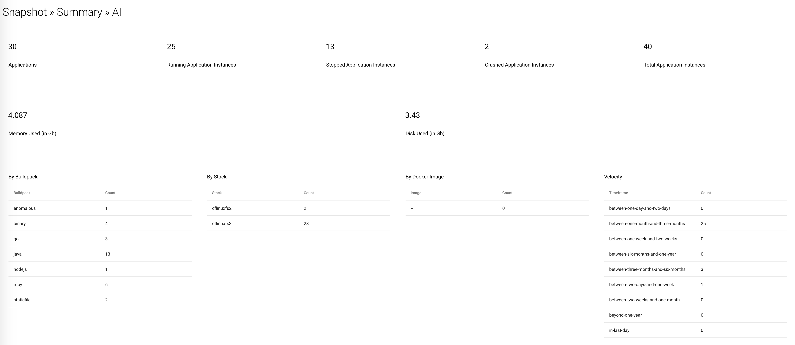

# VMware Tanzu Application Service > Hoover UI

[](https://img.shields.io/badge/Release-GA-darkgreen)  [](https://snyk.io/test/github/pacphi/cf-hoover-ui) [](https://jitpack.io/#pacphi/cf-hoover-ui/master-SNAPSHOT) [](https://opensource.org/licenses/Apache-2.0)


You're a platform operator and you've managed to get [cf-hoover](https://github.com/pacphi/cf-hoover) deployed. It's happily aggregating usage data from multiple foundations.  Now your CIO wants you to build a dashboard.

`cf-hoover-ui` humbly aspires to deliver individual dashboards corresponding to each of the endpoints `cf-hoover` exposes.

Here's a sample...



# Table of Contents

  * [Prerequisites](#prerequisites)
  * [Tools](#tools)
  * [Clone](#clone)
  * [How to configure](#how-to-configure)
    * [To set the operations schedule](#to-set-the-operations-schedule)
    * [General configuration notes](#general-configuration-notes)
  * [How to Build](#how-to-build)
  * [How to Run with Maven](#how-to-run-with-maven)
  * [How to deploy to VMware Tanzu Application Service](#how-to-deploy-to-vmware-tanzu-application-service)
    * [using scripts](#using-scripts)
  * [Available UI Endpoints](#available-ui-endpoints)
    * [Accounting](#accounting)
    * [Snapshot](#snapshot)
  * [What else would you like to see?](#what-else-would-you-like-to-see)
  * [Credits](#credits)

## Prerequisites

Required

* [cf-hoover](https://github.com/pacphi/cf-hoover)
* [VMware Tanzu Application Service](https://pivotal.io/platform/pivotal-application-service) 2.11 or better
* [Spring Cloud Services, Service Registry](https://docs.pivotal.io/spring-cloud-services/3-1/common/service-registry/index.html) 3.1.x or better


## Tools

* [git](https://git-scm.com/downloads) 2.40.0 or better
* [JDK](http://openjdk.java.net/install/) 17 or better
* [cf](https://docs.cloudfoundry.org/cf-cli/install-go-cli.html) CLI 8.6.1 or better


## Clone

```
git clone https://github.com/pacphi/cf-hoover-ui.git
```


## How to configure

Make a copy of then edit the contents of the `application.yml` file located in `src/main/resources`.  A best practice is to append a suffix representing the target deployment environment (e.g., `application-pws.yml`, `application-pcfone.yml`). You will need to provide administrator credentials to Apps Manager for the foundation if you want the butler to keep your entire foundation tidy.

> You really should not bundle configuration with the application. To take some of the sting away, you might consider externalizing and/or [encrypting](https://blog.novatec-gmbh.de/encrypted-properties-spring/) this configuration.

### To set the operations schedule

`cf-hoover-ui` periodically queries an instance of `cf-hoover` to obtain foundation data.  It does this by configuring a Spring Cloud Loadbalancer [filter](https://docs.spring.io/spring-cloud-commons/docs/current/reference/html/#webflux-with-reactive-loadbalancer) for use with [WebClient](https://docs.spring.io/spring-boot/docs/current/reference/html/boot-features-webclient.html#boot-features-webclient).

Update the value of the `cron.collection` property in `application.yml`.  Consult this [article](https://www.baeldung.com/spring-scheduled-tasks) and the [Javadoc](https://docs.spring.io/spring-framework/docs/current/javadoc-api/org/springframework/scheduling/annotation/Scheduled.html#cron--) to understand how to tune it for your purposes.

### General configuration notes

If you copied and appended a suffix to the original `application.yml` then you would set `spring.profiles.active` to be that suffix

E.g., if you had a configuration file named `application-pws.yml`

```
./mvw spring-boot:run -Dspring.profiles.active=pws
```

## How to Build

```
./mvnw --batch-mode --update-snapshots -DskipTests -P production verify
```


## How to Run with Maven

If you intend to run `cf-hoover-ui` in a local development environment, you must first:

* Launch a standalone instance of [Eureka server](https://cloud.spring.io/spring-cloud-netflix/multi/multi_spring-cloud-eureka-server.html)
* Launch an instance of [cf-hoover](https://github.com/pacphi/cf-hoover#how-to-run-with-gradle)

Then:

```
./mvw spring-boot:run -Dspring.profiles.active={target_foundation_profile}
```
where `{target_foundation_profile}` is something like `pws` or `pcfone`

> You'll need to manually stop to the application with `Ctrl+C`


## How to deploy to VMware Tanzu Application Service

Please review the [manifest.yml](manifest.yml) before deploying.

### using scripts

Deploy the app (bound to a pre-existing instance of Spring Cloud Service Registry)

```
./deploy.sh
```

Shutdown and delete the app with

```
./destroy.sh
```

## Available UI Endpoints

### Accounting

Official system-wide reporting for all foundations registered

```
GET /accounting/applications
```
> Provides summary metrics for application instances by year and month across all registered foundations

```
GET /accounting/service/plans
```
> Provides summary metrics for service instances by year and month and then by plan across all registered foundations

```
GET /accounting/services
```
> Provides summary metrics for service instances by year and month across all registered foundations

```
GET /accounting/tasks
```
> Provides summary metrics for tasks by year and month across all registered foundations

### Snapshot

Point in time capture of all workloads

```
GET /snapshot/detail/ai
```
> Provides filterable list of all applications (by foundation, organization and space)

```
GET /snapshot/detail/si
```
> Provides filterable list of all service instances (by foundation, organization and space)

```
GET /snapshot/detail/users
```
> Provides filterable lists of all user and service accounts

```
GET /snapshot/summary/ai
```
> Provides summary metrics for applications across all registered foundations

```
GET /snapshot/summary/si
```
> Provides summary metrics for service instances across all registered foundations

```
GET /snapshot/demographics
```
> Provides summary metrics for organizations, spaces, user accounts and service accounts across all registered foundations


## What else would you like to see?

What other insight might we glean from available foundation data? Applications, services, tasks, events, logs, users, product info... all fair game.  Submit a [feature request](https://github.com/pacphi/cf-hoover-ui/issues/new).


## Credits

* [Vaadin Flow and Reactive Spring](https://committed.software/posts/vaadin-and-spring/vaadin-spring/)
* [Achieving Fault Tolerance With Resilience4j](https://dzone.com/articles/resilience4j-intro)
* [Spring Boot Demo of Resilience4j](https://github.com/RobWin/resilience4j-spring-boot2-demo)
* [App Layout Tutorial](https://github.com/vaadin-learning-center/flow-layout-app_layout-vaadin)
